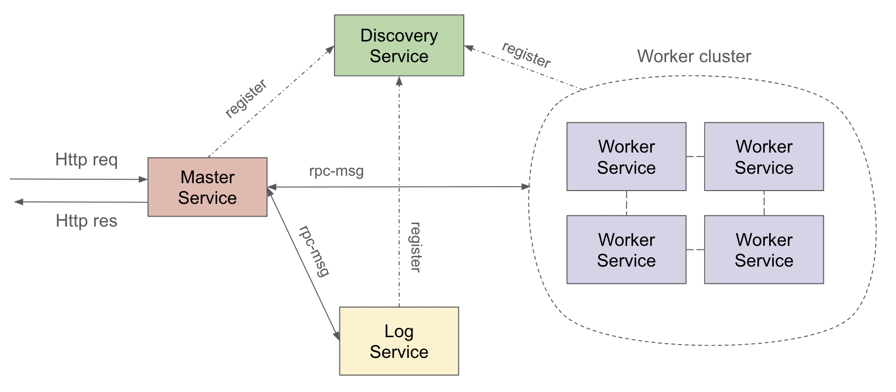

# Reactive System with ActiveJ RPC

This is an example to follow Characteristics of Reactive Systems

- Responsive: systems respond in a timely manner
- Resilient: systems stay responsive in the face of failure
- Elastic: a architecture remains responsive under varying workload
- Message driven: systems rely on asynchronous message-passing to establish a boundary between components that ensures loose coupling, isolation, location transparency, and provides the means to delegate errors as messages

More detail at here: [Reactive Manifesto](https://docs.aws.amazon.com/whitepapers/latest/reactive-systems-on-aws/characteristics-of-reactive-systems.html)

# How to run

1. Run [Discovery-Service](src/main/java/com/uet/microservices/services/discovery/MyDiscoveryService.java)
2. Run [Master-Service](src/main/java/com/uet/microservices/services/master/MasterService.java)
3. Run [Log-Service](src/main/java/com/uet/microservices/services/log/LogService.java)
4. Run [Worker-Service](src/main/java/com/uet/microservices/services/worker/WorkerService.java)
5. Make a HTTP GET Request: http://localhost:9080/test-log -> test LogService
6. Make a HTTP GET Request: http://localhost:9080/test-worker?range=1-10 -> test WorkerService

For scaling, you can clone WorkerService/LogService and run it on another port. 
It will automatically register to DiscoveryService and MasterService will automatically detect new WorkerService/LogService
Make other HTTP GET Request to test scaling.

# Design System

